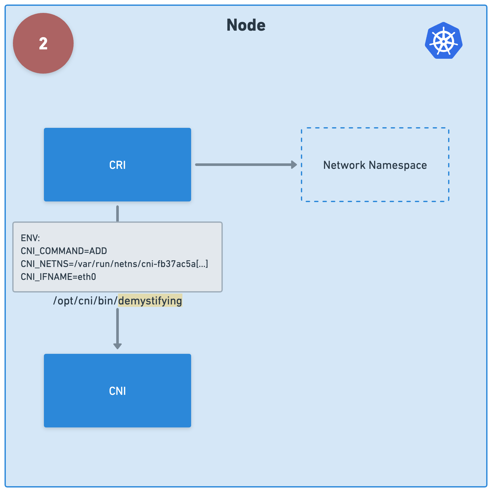
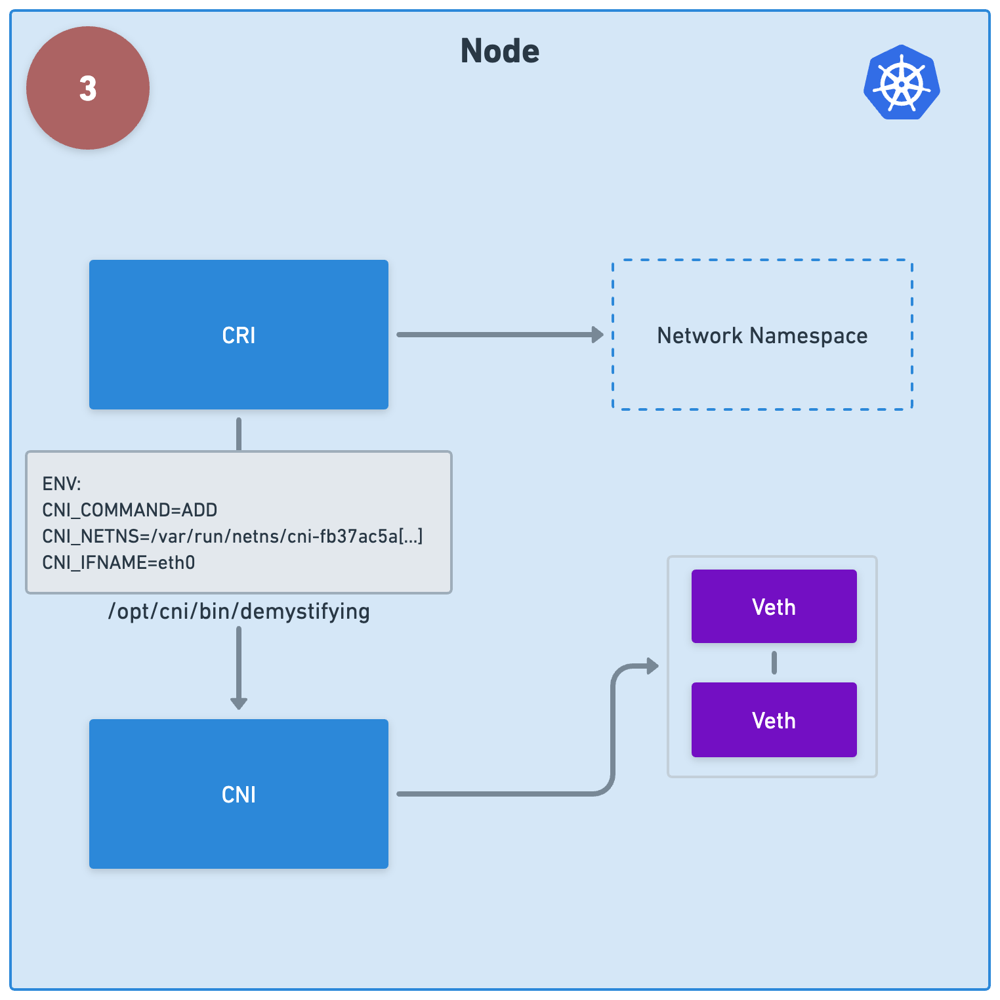
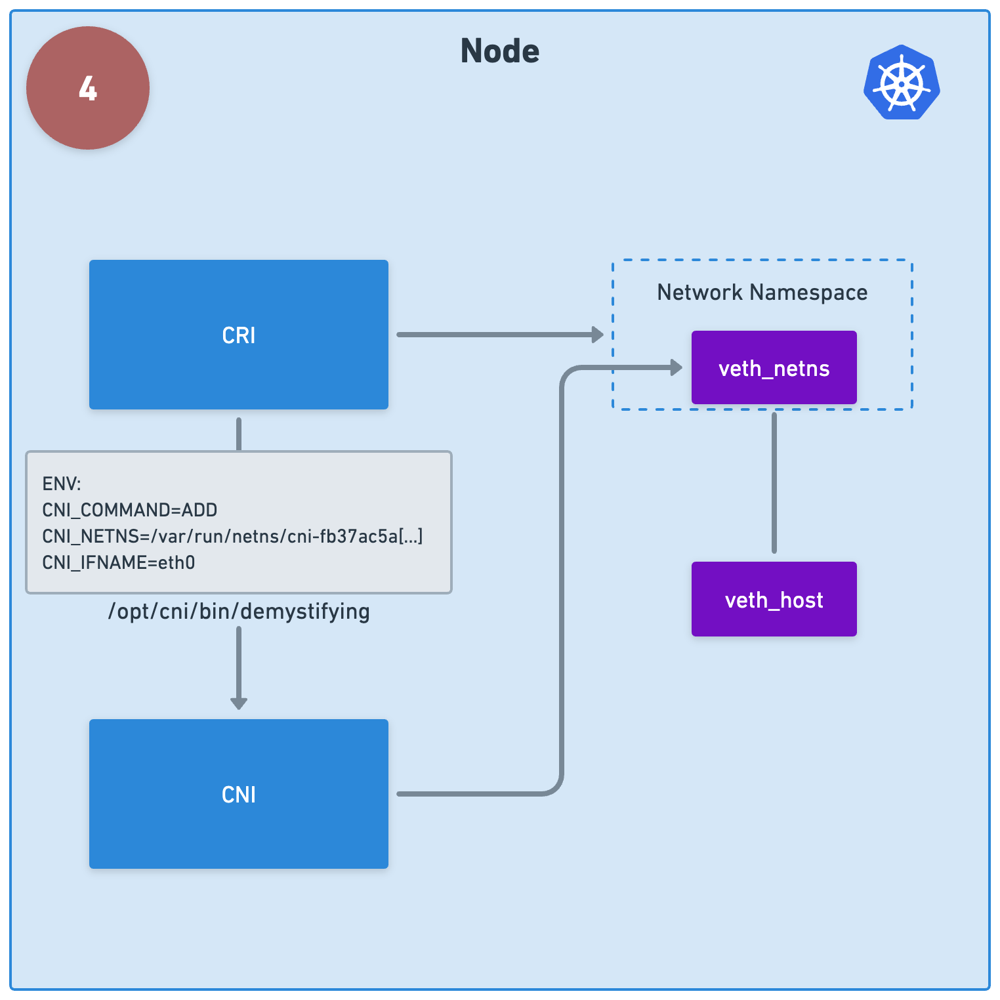

## Reference
https://github.com/f1ko/demystifying-cni

## Create cluster
```bash
kind create cluster --config kind.yaml --name default
```

## Code break down
### 1. CNI Config

```json
// Config manifest under /etc/cni/net.d/
{
  "cniVersion": "1.0.0",
  "name": "hello",
  "type": "demystifying" // executable under /opt/cni/bin/
}
```

### 2. CRI pass data (JSON + environment) to executable


### 3. Create 2 veth: veth_netns and veth_host 

```bash
# create veth
VETH_HOST=veth_host
VETH_NETNS=veth_netns
ip link add ${VETH_HOST} type veth peer name ${VETH_NETNS}
```

### 4. Move veth_netns to container network namespace

```bash
# put one of the veth interfaces into the new network namespace
NETNS=$(basename ${CNI_NETNS})
ip link set ${VETH_NETNS} netns ${NETNS}
```