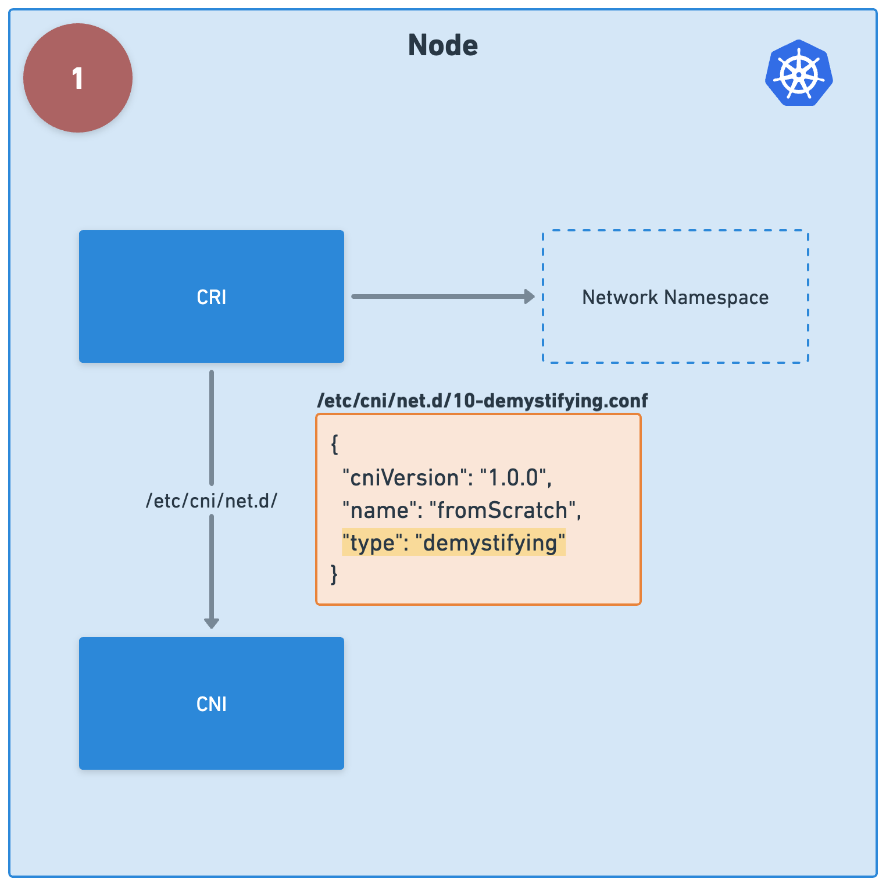

## Reference
https://github.com/f1ko/demystifying-cni

## Create cluster
```bash
kind create cluster --config kind.yaml --name default
```

## Code break down
### CNI Config

```json
// Config manifest under /etc/cni/net.d/
{
  "cniVersion": "1.0.0",
  "name": "hello",
  "type": "executable" // executable under /opt/cni/bin/
}
```

